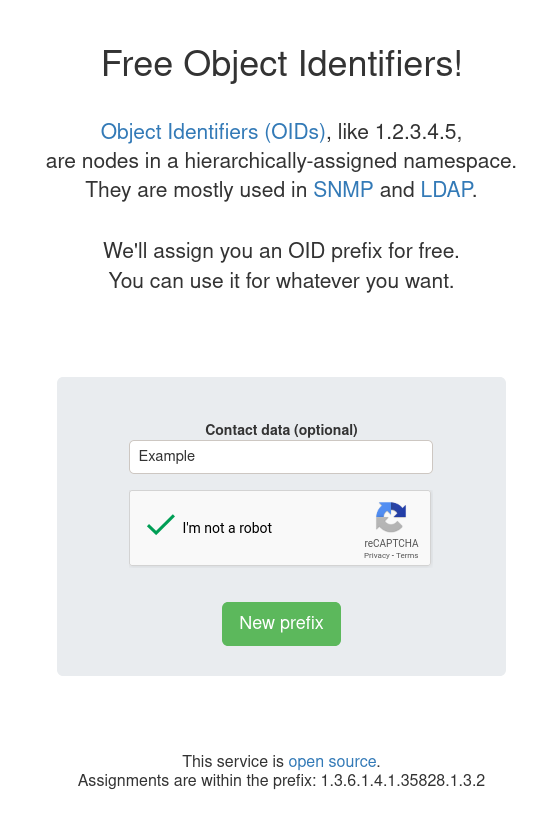
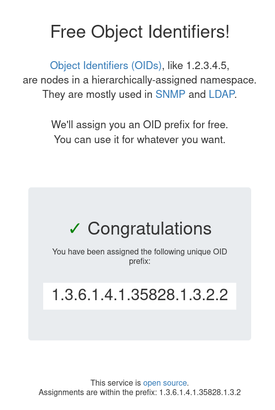

# Free OIDs!

* Author: `Felix Kaiser <felix.kaiser@fxkr.net>`
* License: MIT license
* Version 2.\*

[Object Identifiers (OIDs)][OID] are used to name objects.
OIDs consist of a node in a hierarchically-assigned namespace.
They are mostly used in [SNMP] and [LDAP].

This is a webservice that allows users to get OID prefixes assigned easily.
If you need an OID prefix, you can use our instance at https://oid.entropia.de/.

The first version, in 2014, was made with Python, Flask and a widely used [NoSQL database](https://en.wikipedia.org/w/index.php?title=CSV_file).
The code is still available in the [v1](https://github.com/fxkr/free-oids/tree/v1) branch.
This is the second version, based on Amazon AWS, with a serverless architecture (Lambda, DynamoDB, S3, Route53, CloudFront).
For design and implementation details, see [HACKING.md](./HACKING.md).

[OID]: https://en.wikipedia.org/wiki/Object_identifier
[SNMP]: https://en.wikipedia.org/wiki/Simple_Network_Management_Protocol
[LDAP]: https://en.wikipedia.org/wiki/Lightweight_Directory_Access_Protocol
